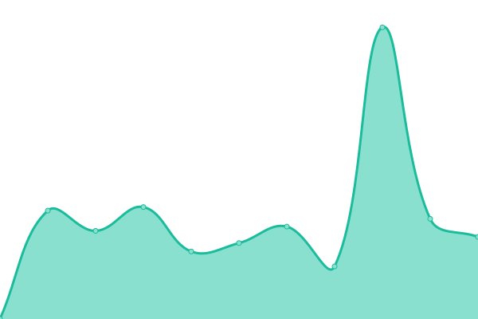
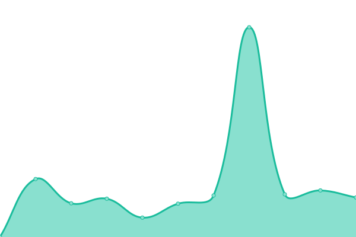

# [📈 Live Status](https://freshairradio.github.io/upptime): <!--live status--> **🟧 Partial outage**

This repository contains the open-source uptime monitor and status page for [Freshair Radio](https://freshair.radio), powered by [Upptime](https://github.com/upptime/upptime).

With [Upptime](https://upptime.js.org), you can get your own unlimited and free uptime monitor and status page, powered entirely by a GitHub repository. We use [Issues](https://github.com/freshairradio/upptime/issues) as incident reports, [Actions](https://github.com/freshairradio/upptime/actions) as uptime monitors, and [Pages](https://freshairradio.github.io/upptime) for the status page.

<!--start: status pages-->
<!-- This summary is generated by Upptime (https://github.com/upptime/upptime) -->
<!-- Do not edit this manually, your changes will be overwritten -->
<!-- prettier-ignore -->
| URL | Status | History | Response Time | Uptime |
| --- | ------ | ------- | ------------- | ------ |
|  [Main Website](https://freshair.radio) | 🟥 Down | [main-website.yml](https://github.com/freshairradio/upptime/commits/HEAD/history/main-website.yml) | 

 943ms
     
 | 

<a href="https://freshairradio.github.io/upptime/history/main-website">100.00%</a>
    

|  [Members Portal](https://ctrl.freshair.radio) | 🟩 Up | [members-portal.yml](https://github.com/freshairradio/upptime/commits/HEAD/history/members-portal.yml) | 

 222ms
     
 | 

<a href="https://freshairradio.github.io/upptime/history/members-portal">100.00%</a>
    

|  [API](https://data.freshair.radio/v1/public/shows) | 🟩 Up | [api.yml](https://github.com/freshairradio/upptime/commits/HEAD/history/api.yml) | 

 613ms
     
 | 

<a href="https://freshairradio.github.io/upptime/history/api">100.00%</a>
    

<!--end: status pages-->

[**Visit our status website →**](https://freshairradio.github.io/upptime)

## 📄 License

- Powered by: [Upptime](https://github.com/upptime/upptime)
- Code: [MIT](./LICENSE) © [Freshair Radio](https://freshair.radio)
- Data in the `./history` directory: [Open Database License](https://opendatacommons.org/licenses/odbl/1-0/)
